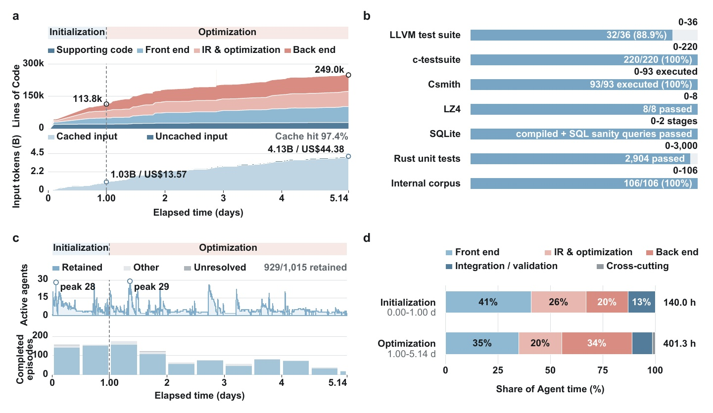
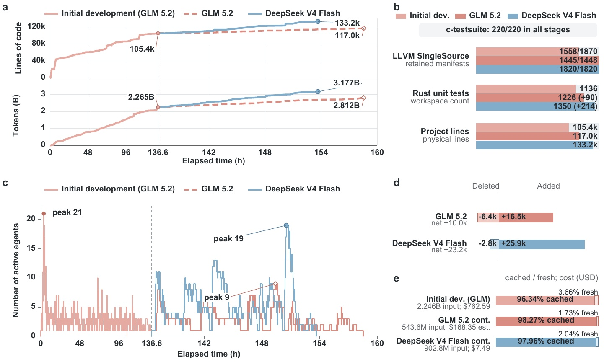
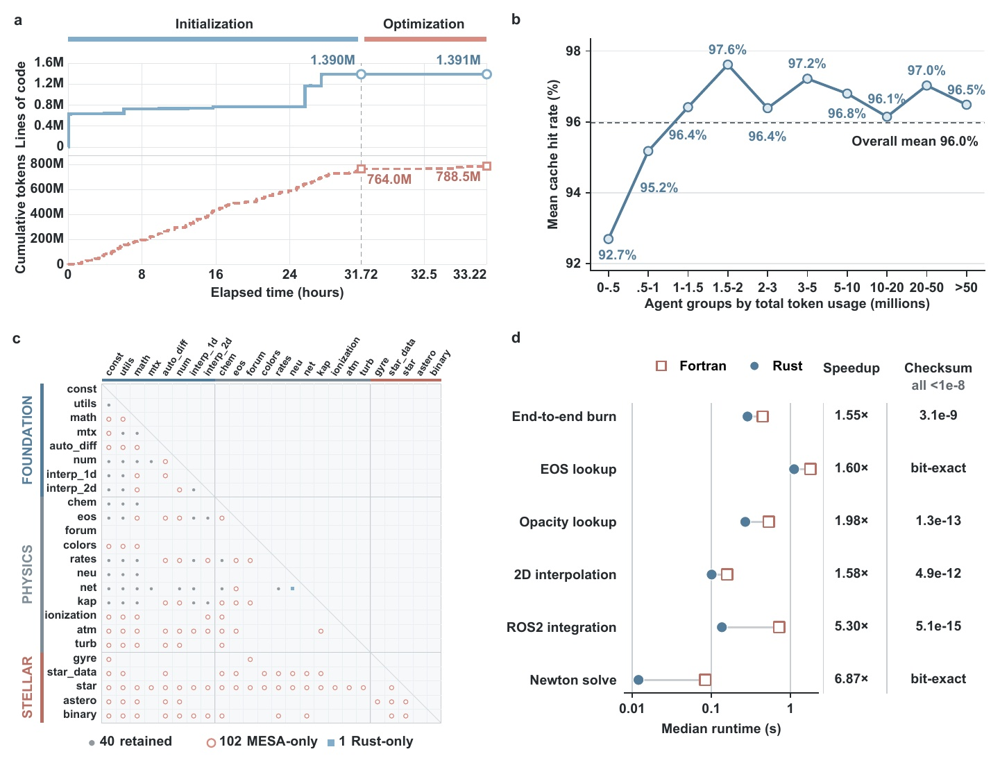

# Genesis — Experimental Results

These are observed system-level results reported in the Genesis paper
(https://arxiv.org/abs/2608.10450). They are **not** normalized model-comparison
benchmarks: they describe what the system-as-a-whole produced in each regime,
under the model and hardware conditions stated for that run.

Reported dollar amounts are foundation-model token charges only. Compiler formation, continuation and MESA redevelopment are observed system-level results, not normalized model-comparison benchmarks. The MESA result covers the audited 13-module scope, not the full application.

---

## Formation — a C compiler from an implementation-empty repository

Genesis used **DeepSeek V4 Flash** to develop a Rust-based C compiler from a repository containing no compiler implementation code.

| Field | Value |
|-------|-------|
| Repository | [github.com/EMI-Group/genesis-demo-jcc](https://github.com/EMI-Group/genesis-demo-jcc) |
| Scope | implementation-empty repository → **248,989-line C compiler** |
| Run | **123.4 h · 1,019 archived agent episodes · US$44.38** (≈US$98 at DeepSeek's current pricing) |
| Validation | **220/220** c-testsuite · **32/36** LLVM · **93/93** executed Csmith · **2,904** Rust tests · **106/106** internal cases |
| Development | observed recursive depth **5** · **327** first-parent commits |

  

---

## Continuation — the model changed, development continued

Genesis continued the same accepted compiler world independently with **GLM 5.2** and **DeepSeek V4 Flash**.

| Field | Value |
|-------|-------|
| Repository | [github.com/EMI-Group/genesis-demo-jcc](https://github.com/EMI-Group/genesis-demo-jcc) |
| Scope | one accepted compiler world → two independent continuation trajectories |
| Run | GLM 5.2: **21.99 h · 98 agents** · DeepSeek V4 Flash: **17.10 h · 178 agents** |
| Validation | GLM 5.2: **1,445/1,448** · DeepSeek V4 Flash: **1,820/1,820** retained LLVM SingleSource cases |
| Development | both retained **220/220** c-testsuite and **4/4** LZ4 · observed recursive depths **4** and **8** |

  

---

## Redevelopment — MESA → Rust, with numerical behaviour preserved

Genesis redeveloped a selected chain of **13 MESA Fortran modules** into corresponding Rust crates.

| Field | Value |
|-------|-------|
| Repository | [github.com/EMI-Group/genesis-demo-mesa-rs](https://github.com/EMI-Group/genesis-demo-mesa-rs) |
| Scope | **139,414 Fortran lines → 89,946-line Rust workspace** |
| Run | **33.22 h · 272 agents · US$10.64** |
| Validation | **1,052 tests · 0 failures** · **2 bit-exact** workloads · remaining relative checksum differences ≤ **3.1 × 10⁻⁹** |
| Development | observed recursive depth **4** · median runtime speedups **1.55×–6.87×** |

  

---

## Terminal-Bench Challenges

As far as we can determine, Genesis is the first publicly known autonomous system to submit a result for the [Terminal-Bench Challenges](https://github.com/BillHuang2001/tbench-wasm) — specifically the WASM Render challenge. The run cost just **US$36** — far below Terminal-Bench's stated expectation of ~US$1K+ per challenge.

---

## Further reading

Paper: https://arxiv.org/abs/2608.10450 · Promo film: https://genesis.evox.group
